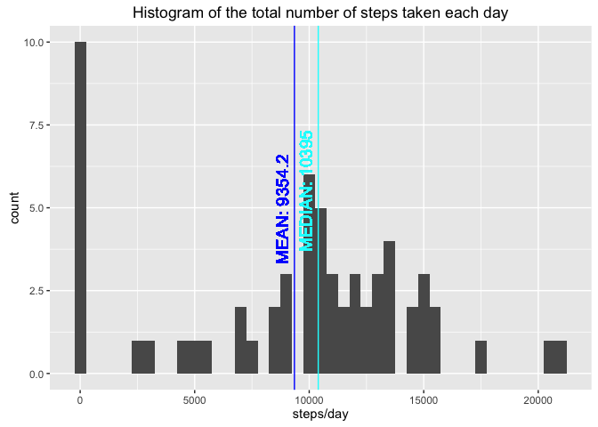
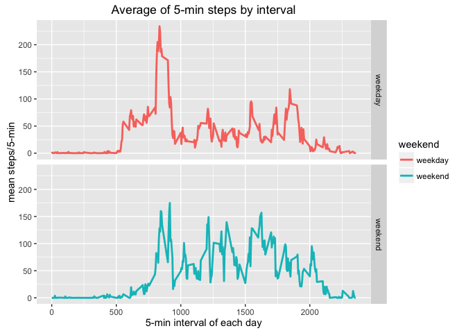

# Reproducible Research - Course Project 1
Jose Lao  
17 de abril de 2016  
This assignment makes use of data from a personal activity monitoring device.
<br><br>
This device collects data at 5 minute intervals through out the day.

The data consists of two months of data from an anonymous individual collected during the months of October and November, 2012 and include the number of steps taken in 5 minute intervals each day.

you will find these files:

* activity.csv --> the RAw data for analisys
* code.R --> with all the R code for performing analisys
* PA1_template.html --> this document
* PA1_template.Rmd --> the RMarkdown document that creates "PA1_template.html"


### Obtaining RAW data

The data are originally downloaded from: [https://d396qusza40orc.cloudfront.net/repdata%2Fdata%2Factivity.zip](https://d396qusza40orc.cloudfront.net/repdata%2Fdata%2Factivity.zip)

But you can get the file inside the repository, file: **activity.csv**


### libraries used
Here are the main libraries used.


```r
library(ggplot2)
```

```
## Warning: package 'ggplot2' was built under R version 3.2.4
```

```r
library(plyr)
library(reshape2)
```

Also it will be necesary to install "impute" library, bacause we need the "impute.knn" function, this is for the k-nearest-neighbors imputation of missing data process. For installing try:


```r
# source("https://bioconductor.org/biocLite.R") # try http:// if https:// URLs are not supported
# biocLite("impute")
library(impute)
```


### setting working directory
use:

```r
setwd("<<your working directory>>")
```


### 1) Code for reading in the dataset and/or processing the data

Here we will read the data and introduce new columns for classify weekdays and weekend days.


```r
# Reading data
DATA <- read.csv("activity.csv")

# converting to data class
DATA$date <- as.Date(strptime(DATA$date,"%Y-%m-%d"))

# introducing weekdays
DATA$day <- format(DATA$date, "%u") # Weekday as a decimal number (1–7, Monday is 1)
DATA$day2 <- as.factor(weekdays(DATA$date, abbreviate=TRUE))
DATA$weekend <- 0
DATA$weekend[DATA$day == 6 | DATA$day == 7] <- 1
DATA$weekend <- factor(DATA$weekend, levels=c(0,1), labels=c("weekday","weekend"))
```

The variables included in this dataset are:

* steps: Number of steps taking in a 5-minute interval (missing values are coded as 𝙽𝙰)
* date: The date on which the measurement was taken in YYYY-MM-DD format
* interval: Identifier for the 5-minute interval in which measurement was taken

The dataset is stored in a comma-separated-value (CSV) file and there are a total of 17,568 observations in this dataset.

Here there are a example of the data including new columns (day, day and weekend):

```r
head(DATA)
```

```
##   steps       date interval day day2 weekend
## 1    NA 2012-10-01        0   1  lun weekday
## 2    NA 2012-10-01        5   1  lun weekday
## 3    NA 2012-10-01       10   1  lun weekday
## 4    NA 2012-10-01       15   1  lun weekday
## 5    NA 2012-10-01       20   1  lun weekday
## 6    NA 2012-10-01       25   1  lun weekday
```


### 2) Histogram of the total number of steps taken each day

For the histogram of steps/day we sum the steps for each day usign ddply function


```r
DATA.sum.day <- ddply(DATA, .(date), summarize, steps = sum(steps, na.rm=TRUE)) # DATA statistics by day
ggp1 <- ggplot(data=DATA.sum.day, aes(steps)) + geom_histogram(binwidth=500)
ggp1 <- ggp1 + xlab("steps/day")
ggp1 <- ggp1 + labs(title = "Histogram of the total number of steps taken each day")
plot(ggp1)
```


### 3) Mean and median number of steps taken each day
Introducing the mean and median to the previous plot

```r
MEAN <- mean(DATA.sum.day$steps)
MEDIAN <- median(DATA.sum.day$steps)
ggp1 <- ggp1 + geom_vline(xintercept = MEAN, colour="blue")
ggp1 <- ggp1 + geom_text(aes(x=MEAN, y=0, label=paste0("MEAN: ",round(MEAN,1))), colour="blue", size=5, angle=90, hjust=-1, vjust=-0.5)
ggp1 <- ggp1 + geom_vline(xintercept = MEDIAN, colour="cyan")
ggp1 <- ggp1 + geom_text(aes(x=MEDIAN, y=0, label=paste0("MEDIAN: ",round(MEDIAN,1))), colour="cyan", size=5, angle=90, hjust=-1, vjust=-0.5)
plot(ggp1)
```




### 4) Time series plot of the average number of steps taken

The daily mean requires the ddply function for mean ecah day


```r
DATA.mean.interval <- ddply(DATA, .(interval), summarize, steps=mean(steps, na.rm=TRUE))
ggp2 <- ggplot(data=DATA.mean.interval, aes(interval, steps)) + geom_line(size=1)
ggp2 <- ggp2 + xlab("5-min interval of each day") + ylab("mean steps/5-min")
ggp2 <- ggp2 + labs(title = "Average of 5-min steps by interval")
plot(ggp2)
```


### 5) The 5-minute interval that, on average, contains the maximum number of steps

Identifiying and plotting the max. num of steps in a 5-min interval


```r
MAX.interval <- DATA.mean.interval[which.max(DATA.mean.interval$steps), ]
ggp2 <- ggp2 + geom_point(data=MAX.interval, aes(interval, steps), size=2, color="red")
ggp2 <- ggp2 + geom_text(data=MAX.interval, aes(interval, steps, label=paste0("MAX:",round(MAX.interval$steps,1)," steps at interval: ",MAX.interval$interval)), size=4, color="red", hjust=-0.1)
plot(ggp2)
```


### 6) Code to describe and show a strategy for imputing missing data
First of all I want to know how many NAs are...

```r
# counting number of NA
table(is.na(DATA$steps))
```

```
## 
## FALSE  TRUE 
## 15264  2304
```

```r
# there are 2304 NAs, that is the 13% of the whole data:
2304/(15264 + 2304)
```

```
## [1] 0.1311475
```
So there are 13.1147541% of NA values

For better comprension of NA values I perform some cast.

```r
DATA.cast <- dcast(DATA, date+day+day2+weekend~interval, value.var="steps")
```

We will see that all the NAs are due to full day with no data tracking

```r
head(DATA.cast)
```

```
##         date day day2 weekend  0  5 10 15 20 25 30 35 40 45 50 55 100 105
## 1 2012-10-01   1  lun weekday NA NA NA NA NA NA NA NA NA NA NA NA  NA  NA
## 2 2012-10-02   2  mar weekday  0  0  0  0  0  0  0  0  0  0  0  0   0   0
## 3 2012-10-03   3  mié weekday  0  0  0  0  0  0  0  0  0  0  0  0   0   0
## 4 2012-10-04   4  jue weekday 47  0  0  0  0  0  0  0  0  0  0  0   0   0
## 5 2012-10-05   5  vie weekday  0  0  0  0  0  0  0  0  0  0  0  0   0   0
## 6 2012-10-06   6  sáb weekend  0  0  0  0  0  0  0  0  0  0  0  0   0   0
##   110 115 120 125 130 135 140 145 150 155 200 205 210 215 220 225 230 235
## 1  NA  NA  NA  NA  NA  NA  NA  NA  NA  NA  NA  NA  NA  NA  NA  NA  NA  NA
## 2   0   0   0   0   0   0   0   0   0   0   0   0   0   0   0   0   0   0
## 3   0   0   0   0   0   0   0   0   0   0   0   0   0   0   0   0   0   0
## 4   0   0   0   0   0   0   0   0   0   0   0   0   0   0   0   0   0   0
## 5   0   0   0   0   0   0   0   9  14   0   0   0   0   0   0   7   0   0
## 6   0   0   0   0   0   0   0   0   0   0   0   0   0   0   0   0   0   0
##   240 245 250 255 300 305 310 315 320 325 330 335 340 345 350 355 400 405
## 1  NA  NA  NA  NA  NA  NA  NA  NA  NA  NA  NA  NA  NA  NA  NA  NA  NA  NA
## 2   0   0   0   0   0   0   0   0   0   0   0   0   0   0   0   0   0   0
## 3   0   0   0   0   0   0   0   0   0   0   0   0   0   0   0   0   0   0
## 4   0   0   0   0   0   0   0   0   0   0   0   0   0   0   0   0   0   0
## 5   0   0  27   0   0   0   0   0   0   0   0   0   0   0   0   0   0  39
## 6   0   0   0   0   0   0   0   0   0   0  40  11   0   0   0   0   0   0
##   410 415 420 425 430 435 440 445 450 455 500 505 510 515 520 525 530 535
## 1  NA  NA  NA  NA  NA  NA  NA  NA  NA  NA  NA  NA  NA  NA  NA  NA  NA  NA
## 2   0   0   0   0   0   0   0   0   0   0   0   0   0   0   0   0   0   0
## 3   4   0   0   0  36   0   0   0   0   0   0   0   0   0   0   0   0  25
## 4   0   0   0   0   0   0   0   0   0   0   0   0   7  18  57  40   0   0
## 5   0   0   0   0   0   0   0   0   0   0   0  27   0   0   0   0   0   0
## 6   0   0   0  19  67   0   0   0   0   0   0   0   0   0   0   0   0   0
##   540 545 550 555 600 605 610 615 620 625 630 635 640 645 650 655 700 705
## 1  NA  NA  NA  NA  NA  NA  NA  NA  NA  NA  NA  NA  NA  NA  NA  NA  NA  NA
## 2   0   0   0   0   0   0   0   0   0   0   0   0   0   0   0   0   0   0
## 3   0   0  90 411 413 415 519 529 613 562 612 534 323 600 533 251  56   0
## 4   0   0  16   1   0  18  20  40  36  17  49  86  49   0  29  59   7  25
## 5   0   0   0  52  36   0   0  28  67 119   7  21  29  68  29   0  11  19
## 6  27   0   0   0   0   0   0  36  50  38   0   4  42  14   8 135 172 124
##   710 715 720 725 730 735 740 745 750 755 800 805 810 815 820 825 830 835
## 1  NA  NA  NA  NA  NA  NA  NA  NA  NA  NA  NA  NA  NA  NA  NA  NA  NA  NA
## 2   0   0   0   0   0   0   0   0   0   0   0   0   0   0   0   0   0   0
## 3  32  80  10   9 145  46   0  44 126  42 138  53   0   0  22  57 161  19
## 4  30  31   7  18 113 181  87   0   0   0  57  99 507 522 510 519 508 423
## 5  84  50   2  43 126  30  19   8 171  68 114   0   9 122 400 451 371 470
## 6  31  52   0 104 170  58   0   0  75   0   0 211 321 149   0  82  94 225
##   840 845 850 855 900 905 910 915 920 925 930 935 940 945 950 955 1000
## 1  NA  NA  NA  NA  NA  NA  NA  NA  NA  NA  NA  NA  NA  NA  NA  NA   NA
## 2   0   0   0   0   0   0   0   0   0   0   0   0   0   0   0   0    0
## 3  15   0  16   0   0   8   0  51 516 245   0 161   7   0   0   0    0
## 4 499 259  31  17   0   0   0   0   0  17   0 145 453 229 144   0    0
## 5 473 512 449 496 530 509 252  84  16   0   6  46  39   0   0   0    0
## 6 216 199  50 187  30   0  65 173  43   0   0   0   0   0   0   0   16
##   1005 1010 1015 1020 1025 1030 1035 1040 1045 1050 1055 1100 1105 1110
## 1   NA   NA   NA   NA   NA   NA   NA   NA   NA   NA   NA   NA   NA   NA
## 2    0    0    0    0    0    0    0    0    0    0    0    0    0    0
## 3    0    0    0    0    0    0    0    0    0    0    0    0    0    0
## 4    0   82    0    0    0    0    0    0    0    0    0    0    0    0
## 5    0    0    0    0    0    0    0    0    0    0    0    0    0    0
## 6   26    0    0    0    0    0    0    0    0    0    0    0    0    0
##   1115 1120 1125 1130 1135 1140 1145 1150 1155 1200 1205 1210 1215 1220
## 1   NA   NA   NA   NA   NA   NA   NA   NA   NA   NA   NA   NA   NA   NA
## 2    0    0    0    0    0    0    0    0    0    0    0    0    0    0
## 3    0    0    0    0   72   73    0    0  116   97    0    0    0    0
## 4    0    0  180   21    0    0    0    0    0  160   79    0    0    0
## 5    0    0    0    0    0    0    0    0    0  138  541  555  345  345
## 6    0    0    0    0   95   64    7   33   72  221  439  519  440  394
##   1225 1230 1235 1240 1245 1250 1255 1300 1305 1310 1315 1320 1325 1330
## 1   NA   NA   NA   NA   NA   NA   NA   NA   NA   NA   NA   NA   NA   NA
## 2    0    0    0    0    0    0    0    0    0    0    0    0    0    0
## 3    0   15    0    0    0    0    0   80   69    0    0    0    0    0
## 4   46   66  127    0    0    0    0    0    0   31    0    0    0    0
## 5   10  485  515  168    0    0    0    0    0    0    0  349  341    0
## 6   97   71   10   87  443  500  465  485  351  515  511  506  486  171
##   1335 1340 1345 1350 1355 1400 1405 1410 1415 1420 1425 1430 1435 1440
## 1   NA   NA   NA   NA   NA   NA   NA   NA   NA   NA   NA   NA   NA   NA
## 2    0    0    0    0    0    0    0    0    0    0    0    0    0    0
## 3    0    0   99  100    0    0   33    0    0    7    0    0    0    0
## 4    0   28  496   78    0    0    0    0    0    0    0    0   77   20
## 5    0    0    0    0  158  545   82    0  105    0    0    0    0    0
## 6   12   24   42  140   15    0   43   67   48    0    0    9   31   30
##   1445 1450 1455 1500 1505 1510 1515 1520 1525 1530 1535 1540 1545 1550
## 1   NA   NA   NA   NA   NA   NA   NA   NA   NA   NA   NA   NA   NA   NA
## 2    0    0    0    0    0    0    0    0    0    0    0    0    0    0
## 3    0    0    0    0    0    0    0    0    0    0    0    0   88  154
## 4    7    1  128  354  310    0    0   25   15    0    0    0    0   33
## 5    0    0    0    0    0    0    0    0    0    0    0  326  172  332
## 6   64  115   25    0   27    0    0    0    0    0    0    0    0    0
##   1555 1600 1605 1610 1615 1620 1625 1630 1635 1640 1645 1650 1655 1700
## 1   NA   NA   NA   NA   NA   NA   NA   NA   NA   NA   NA   NA   NA   NA
## 2    0    0    0    0    0    0    0    0    0    0    0    0    0    0
## 3    0   20    0    0    0    0    0    0    0    0    0    0    0    0
## 4   33   32   66   77    0   44    0    0    0    0    0    0    0    0
## 5  402   70    0    0    0    0    0    0    0    0    0    0    0    0
## 6    0   27   27    0    0    9    0    0   54   35    0   49    0    0
##   1705 1710 1715 1720 1725 1730 1735 1740 1745 1750 1755 1800 1805 1810
## 1   NA   NA   NA   NA   NA   NA   NA   NA   NA   NA   NA   NA   NA   NA
## 2    0    0    0    0    0    0    0    0    0    0    0    0    0    0
## 3    0  198   61   75    0    0  193  298    0   15   21    0    0    0
## 4    0    0    0    0   40    0   37   90   53   73   92  285  527  531
## 5    0    0   53    0    0    0    0    0    0    7   10   65   40   15
## 6    0    0   93    0    0   13    0    6   12    0    0   34   77  173
##   1815 1820 1825 1830 1835 1840 1845 1850 1855 1900 1905 1910 1915 1920
## 1   NA   NA   NA   NA   NA   NA   NA   NA   NA   NA   NA   NA   NA   NA
## 2    0    0    0    0    0    0    0    0    0    0    0    0    0    0
## 3    0   51   36    0   26   22    0   39   52   15   41    0   42    0
## 4  547  175  114   62    0   59   65    0  101   43    0    0    0   49
## 5   29    0   20   35   69   25   46   15   26   33   58   75   59    0
## 6  370  402  504  485  437  526  264    0   35  124   93    0    0    0
##   1925 1930 1935 1940 1945 1950 1955 2000 2005 2010 2015 2020 2025 2030
## 1   NA   NA   NA   NA   NA   NA   NA   NA   NA   NA   NA   NA   NA   NA
## 2    0    0    0    0    0    0    0    0    0    0    0    0    0    0
## 3    0  159   32    0    0    0    0   34    0    0    0    0   36   73
## 4   21    0   16   56    0    0    0    0    0    0    0    0    0    0
## 5    0    0    0    0    0    0    0    0    0    0    0    0    0    0
## 6    0    0    0    0    0    0    0    0    0   33  118    0    6    0
##   2035 2040 2045 2050 2055 2100 2105 2110 2115 2120 2125 2130 2135 2140
## 1   NA   NA   NA   NA   NA   NA   NA   NA   NA   NA   NA   NA   NA   NA
## 2    0    0    0    0    0    0    0    0    0    0    0    0    0    0
## 3    9    0    0    0    0    0    0    0    0    0    0   90  128   46
## 4    0   17   15    0    0   27  106  122   41   35    6    0    0   68
## 5   71    0    0    0    0    0    0    0    0    0    0    0    0    0
## 6  262   33   46   35    0    0    0    0    0    0    0    0    0    0
##   2145 2150 2155 2200 2205 2210 2215 2220 2225 2230 2235 2240 2245 2250
## 1   NA   NA   NA   NA   NA   NA   NA   NA   NA   NA   NA   NA   NA   NA
## 2    0    0    0    0    0  117    9    0    0    0    0    0    0    0
## 3    0    0    0    0    0    0    0    0    0    0    0    0    0    0
## 4    0    0    0    0    0    0    0    0    0    0    0    0    0    0
## 5    0    0    0    0    0    0    0    0    0    0    0    0    0    0
## 6    0    0    0    0    0    0    0    0    0    0    0    0    0    0
##   2255 2300 2305 2310 2315 2320 2325 2330 2335 2340 2345 2350 2355
## 1   NA   NA   NA   NA   NA   NA   NA   NA   NA   NA   NA   NA   NA
## 2    0    0    0    0    0    0    0    0    0    0    0    0    0
## 3    0    0    0    0    0    0    0    0    0    0    8    0    0
## 4    0    0    0    0    0    0    0    0    0    0    0    0    0
## 5    0    0    0    0    0    0    0    0    0    0    0    0    0
## 6    0    0    0    0    0    0    0    0    0    0    0    0    0
```

I will check now if all the NAs are because full day no tracking or there afe days with mixed values and NAs

```r
# here we can see that all the 2304 NAs are because full day no data recording (DATA.NA subseting)
DATA.NA <- subset(DATA.cast, is.na(DATA.cast[,5]))
```

So we can see that all the NAs are inside the DATA.NA subtable, so all the NAs are full day no tracking:

```r
table(is.na(melt(DATA.NA, id=c("date","day","day2", "weekend"))$value))
```

```
## 
## TRUE 
## 2304
```

so my strategy for Imputing missing values is to use impute.knn function:

```r
# installing Impute function from Bioconductor.org
# you need this library for doing a k-nearest-neighbors imputation of missing data 
# source("https://bioconductor.org/biocLite.R") # try http:// if https:// URLs are not supported
# biocLite("impute")
library(impute)

DATA.imputed <- as.data.frame(impute.knn(as.matrix(DATA.cast[,5:NCOL(DATA.cast)]))$data)
```

```
## Warning in knnimp(x, k, maxmiss = rowmax, maxp = maxp): 8 rows with more than 50 % entries missing;
##  mean imputation used for these rows
```

```r
DATA.imputed <- cbind(DATA.cast[,1:4], DATA.imputed)
```

At now I melt the DATA.imputed data.frame for easy comparation with original DATA:

```r
# melt the data
DATA.imputed <- melt(DATA.imputed, id=c("date","day","day2","weekend"))
colnames(DATA.imputed) <- c("date","day","day2","weekend","interval","steps")
DATA.imputed <- DATA.imputed[,c("steps","date","interval","day","day2","weekend")]
```

head of original DATA:

```r
head(DATA)
```

```
##   steps       date interval day day2 weekend
## 1    NA 2012-10-01        0   1  lun weekday
## 2    NA 2012-10-01        5   1  lun weekday
## 3    NA 2012-10-01       10   1  lun weekday
## 4    NA 2012-10-01       15   1  lun weekday
## 5    NA 2012-10-01       20   1  lun weekday
## 6    NA 2012-10-01       25   1  lun weekday
```


head of DATA.imputed:

```r
head(DATA.imputed[order(DATA.imputed$date),])
```

```
##         steps       date interval day day2 weekend
## 1   1.7169811 2012-10-01        0   1  lun weekday
## 62  0.3396226 2012-10-01        5   1  lun weekday
## 123 0.1320755 2012-10-01       10   1  lun weekday
## 184 0.1509434 2012-10-01       15   1  lun weekday
## 245 0.0754717 2012-10-01       20   1  lun weekday
## 306 2.0943396 2012-10-01       25   1  lun weekday
```


### 7) Histogram of the total number of steps taken each day after missing values are imputed

```r
DATA.sum.day.imputed <- ddply(DATA.imputed, .(date), summarize, steps = sum(steps, na.rm=TRUE)) # DATA statistics by day
ggp3 <- ggplot(data=DATA.sum.day.imputed, aes(steps)) + geom_histogram(binwidth=500)
ggp3 <- ggp3 + xlab("steps/day")
ggp3 <- ggp3 + labs(title = "Histogram of the total number of steps taken each day (NA data imputed)")
MEAN <- mean(DATA.sum.day$steps)
MEDIAN <- median(DATA.sum.day$steps)
ggp3 <- ggp3 + geom_vline(xintercept = MEAN, colour="blue")
ggp3 <- ggp3 + geom_text(aes(x=MEAN, y=0, label=paste0("MEAN: ",round(MEAN,1))), colour="blue", size=5, angle=90, hjust=-1, vjust=-0.5)
ggp3 <- ggp3 + geom_vline(xintercept = MEDIAN, colour="cyan")
ggp3 <- ggp3 + geom_text(aes(x=MEDIAN, y=0, label=paste0("MEDIAN: ",round(MEDIAN,1))), colour="cyan", size=5, angle=90, hjust=-1, vjust=-0.5)
```

We can see that the histogram changes, but the mean and median don't change from the original data:

```r
plot(ggp3)
```


### 8) Panel plot comparing the average number of steps taken per 5-minute interval across weekdays and weekends

```r
DATA.mean.interval <- ddply(DATA, .(interval, weekend), summarize, steps=mean(steps, na.rm=TRUE))
ggp4 <- ggplot(data=DATA.mean.interval, aes(interval, steps, colour=weekend)) + geom_line(size=1) + facet_grid(weekend~.)
ggp4 <- ggp4 + xlab("5-min interval of each day") + ylab("mean steps/5-min")
ggp4 <- ggp4 + labs(title = "Average of 5-min steps by interval")
plot(ggp4)
```




